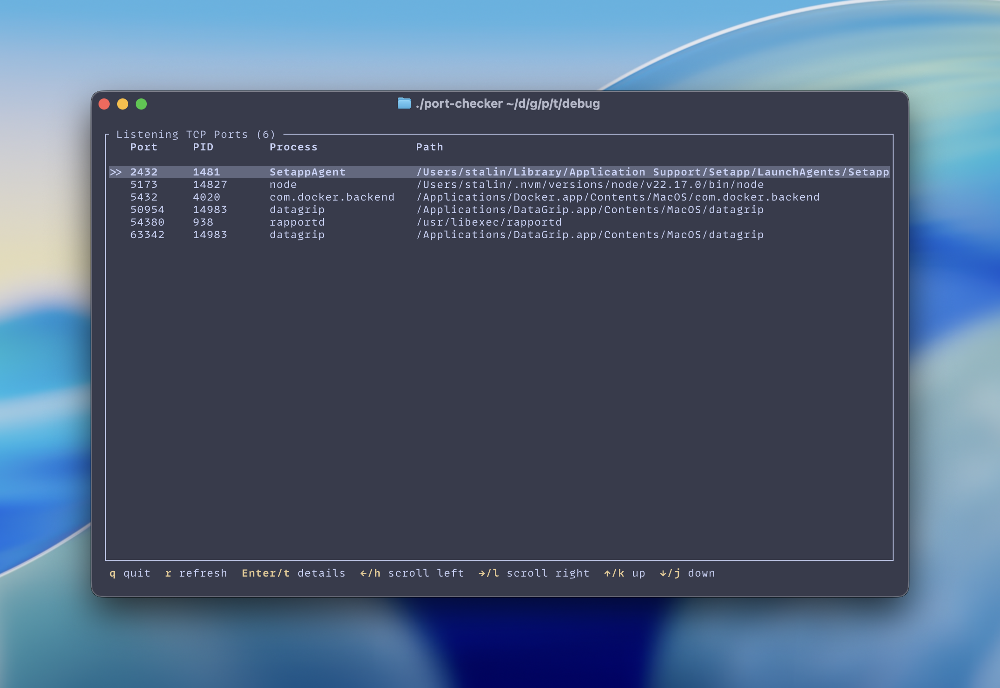
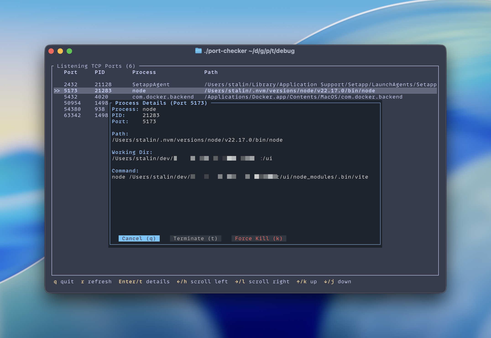

# Port Checker

A fast, lightweight TUI utility to list all listening TCP ports with full process details. Built with Rust and [ratatui](https://ratatui.rs/).





## Features

- List all listening TCP ports with PID, process name, and executable path
- View working directory and full command line arguments
- Horizontal scrolling for long paths
- Process details popup with terminate/force kill actions
- Vim-style keybindings (j/k/h/l)
- Status bar with action feedback

## Installation

### Download Binary

Download the latest release from the [Releases page](https://github.com/imatefx/process-port-check-tui/releases).

```bash
# macOS ARM64 (Apple Silicon)
tar -xzf port-checker-v1.0.0-macos-arm64.tar.gz
./port-checker-macos-arm64

# macOS x64 (Intel)
tar -xzf port-checker-v1.0.0-macos-x64.tar.gz
./port-checker-macos-x64

# Linux ARM64
tar -xzf port-checker-v1.0.0-linux-arm64.tar.gz
./port-checker-linux-arm64

# Linux x64
tar -xzf port-checker-v1.0.0-linux-x64.tar.gz
./port-checker-linux-x64
```

### Build from Source

```bash
git clone https://github.com/imatefx/process-port-check-tui.git
cd process-port-check-tui
cargo build --release
./target/release/port-checker
```

## Keybindings

| Key | Action |
|-----|--------|
| `q` / `Esc` | Quit |
| `r` | Refresh port list |
| `Enter` / `t` | Open process details popup |
| `↑` / `k` | Move up |
| `↓` / `j` | Move down |
| `←` / `h` | Scroll path left |
| `→` / `l` | Scroll path right |
| `Home` | Reset scroll |

### Popup Shortcuts

| Key | Action |
|-----|--------|
| `t` | Terminate process (SIGTERM) |
| `k` | Force kill process (SIGKILL) |
| `q` / `Esc` | Cancel and close |
| `←` / `→` | Navigate buttons |
| `Enter` | Execute selected action |

## Why?

When running multiple instances of the same application (e.g., multiple Node.js servers), it's hard to tell which process is using which port. This tool shows the **working directory** and **full command line**, making it easy to identify each process.

## License

MIT
